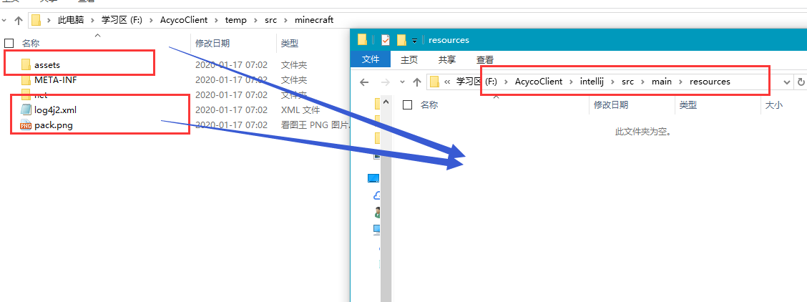
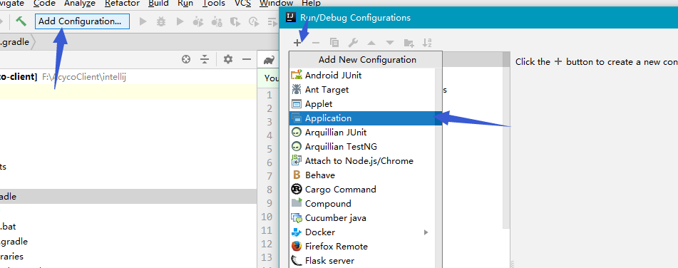
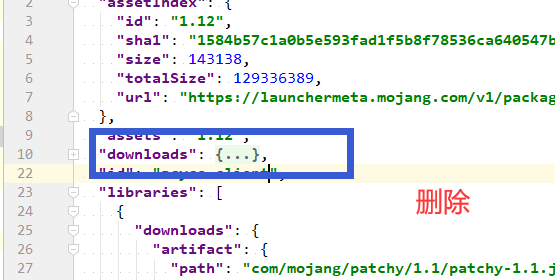

# Acyco Minecraft Client （IDEA）
 
 - 解压mcp 
 
 - 修改配置文件的版本。
 
 
 
 - 解压覆盖。
 
 
 
 - 点击decompile.bat(windows) /decompile.sh
 
 
 
 - 新建文件夹intellij 
  
  
 
 - 新建项目1

  
  
  
  
  
  
 - 复制对应的源码 
 
  
  
 - 复制libraries
 
  
  
 - 新建run工作文件夹
 
  
  
 - 把对应的一些复制到run目录 游戏运行要用到
 
  
 
 - 在build.gradle 文件加入依赖库 -> libraries
 
  
  
  
  - 复制本地库 这个不做后面会报错 
  
    
 
 - add configurations
  
  
  
  
  

  
  
  
 - start 启动(如果步骤没错，正常情况是可以启动。。)

  
  
 - 下面是构建并打包到官启运行
 
  
  
  
  
  
  
  
  
  
  
  
 
  
 
  

  
  
  
 
 
  
 
  
 